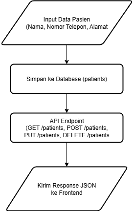

# Simple Clinic API

## Features
- GET /api/patients → list all patients
- POST /api/patients → create new patient
- PUT /api/patients/{id} → update patient
- DELETE /api/patients/{id} → delete patient

## How to Run
1. Clone this repo
2. Run `composer install`
3. Configure `.env` and database
4. Run migration: `php artisan migrate`
5. Start server: `php artisan serve`

## Flow API

